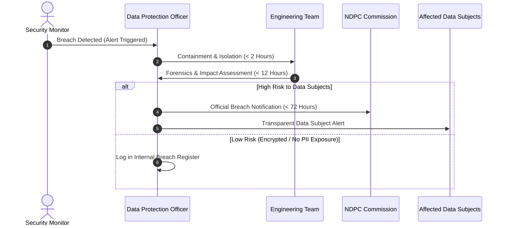

# NDPC Data Protection Compliance & Data Breach Incident Response Plan
**RecruitmentAlert.com.ng**
*Enacted in accordance with the Nigeria Data Protection Act (NDPA 2023) and NDPR 2019*

---

## 1. Data Controller Registration & DPO Designation

- **Organization Name**: RecruitmentAlert.com.ng
- **Data Controller Registration**: Registered with the Nigeria Data Protection Commission (NDPC).
- **Designated Data Protection Officer (DPO)**:
  - **Name/Title**: Lead Compliance Officer, RecruitmentAlert Data Protection Office
  - **Email**: `dpo@recruitmentalert.com.ng`
  - **Emergency Phone**: `+234 800 468 2537` (GOV-ALERT)
  - **DSAR Fulfillment SLA**: All Data Subject Access Requests (DSAR) and Erasure Requests handled within **72 Hours**.

---

## 2. Data Protection Impact Assessment (DPIA) — Crawler System

### System Overview
The RecruitmentAlert monitoring engine operates automated crawlers visiting 42 official Nigerian federal government recruitment portals (`.gov.ng`).

### Risk Analysis & Controls
1. **Data Collected by Crawler**: Public HTML text, recruitment headlines, application deadlines, and official job URLs. No personal data of job applicants is collected from government portals.
2. **Personal Data Collected from Subscribers**: Email addresses (for keyword alerts), Telegram User IDs (for bot alerts), PWA Push Subscriptions (for web push alerts), and security IP logs.
3. **Risk Identification**: Unauthorized database access leaking subscriber email addresses or Telegram IDs.
4. **Technical & Organizational Safeguards**:
   - **Encryption at Rest & in Transit**: TLS 1.3 encryption for all HTTP traffic; database connection encryption.
   - **Data Minimization**: Passwords hashed using PBKDF2 with SHA-256. No payment or financial data stored (service is 100% free).
   - **Sentry PII Scrubbing**: Automated regex filtering stripping emails and Telegram IDs before error telemetry leaves the application server.
   - **Automated Retention Enforcement**: Daily Celery cron job (`clean_expired_personal_data_task`) purging inactive records after 30 days and logs after 90 days.

---

## 3. Data Breach Incident Response Plan (72-Hour Procedure)

In the event of a security incident or suspected unauthorized access to personal data:

### Stage 1: Detection & Initial Containment (Hours 0 – 2)
1. **Isolate Compromised Systems**: Revoke database API tokens, isolate affected web workers or Celery nodes.
2. **Activate Response Team**: Notify DPO (`dpo@recruitmentalert.com.ng`) and Lead Systems Engineer.

### Stage 2: Assessment & Forensics (Hours 2 – 12)
1. Determine categories of data subjects and number of records impacted.
2. Evaluate severity:
   - **Low Risk**: Encrypted tokens exposed without private keys.
   - **High Risk**: Plaintext subscriber email lists or Telegram IDs accessed.

### Stage 3: Mandatory NDPC Notification (Hours 12 – 72)
Under **Section 40 of the NDPA 2023**, if a breach presents a risk to the rights and freedoms of data subjects:
1. Submit official notification to the **Nigeria Data Protection Commission (NDPC)** at `info@ndpc.gov.ng` within **72 hours** of awareness.
2. Notification content:
   - Nature of the breach and estimated number of affected data subjects.
   - Name and contact details of the DPO.
   - Likely consequences of the personal data breach.
   - Remedial measures taken or proposed to be taken.

### Stage 4: Data Subject Notification & Remediation
1. If high risk, notify affected users via email and Telegram bot message detailing:
   - What happened and what data was involved.
   - Recommended actions for users.
   - Mitigation steps taken by RecruitmentAlert.

---

## 4. Internal Data Breach Register Template

| Incident ID | Date/Time Detected | Nature of Breach | Affected Records | Risk Rating | NDPC Notified? | Date Resolved |
|---|---|---|---|---|---|---|
| `INC-2026-001` | `2026-07-25 10:00` | Automated bot probe blocked by WAF | 0 (No data breach) | LOW | No | `2026-07-25 10:05` |
